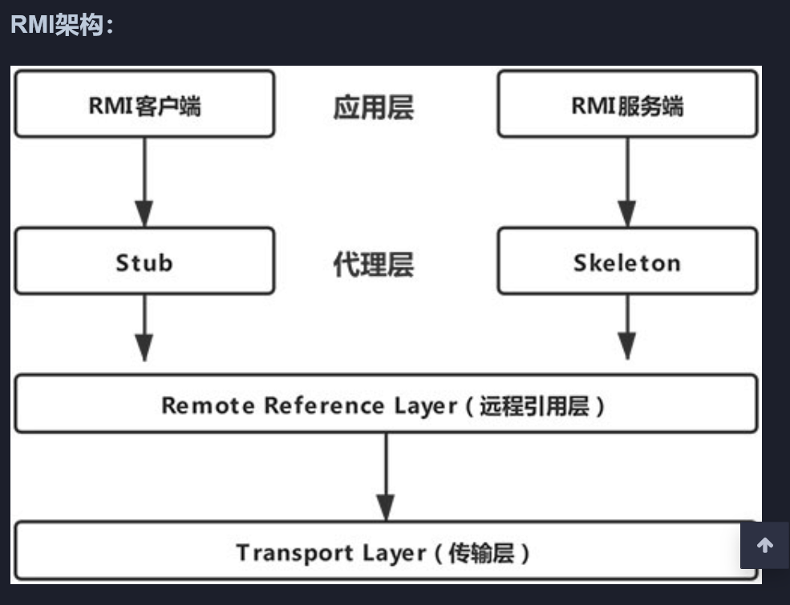
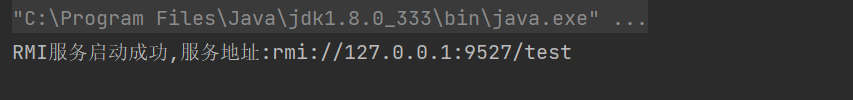
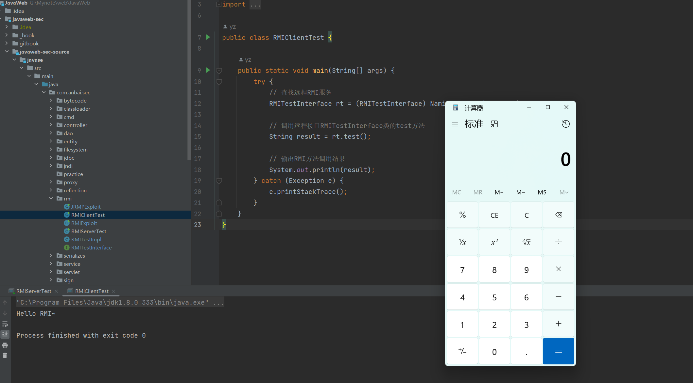
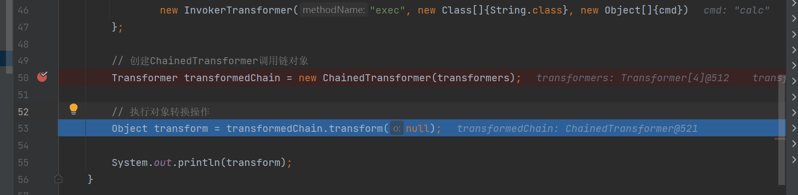
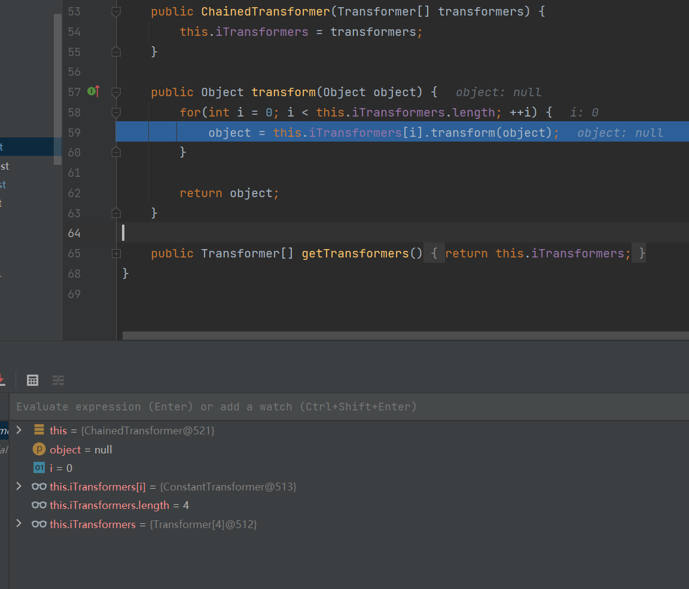
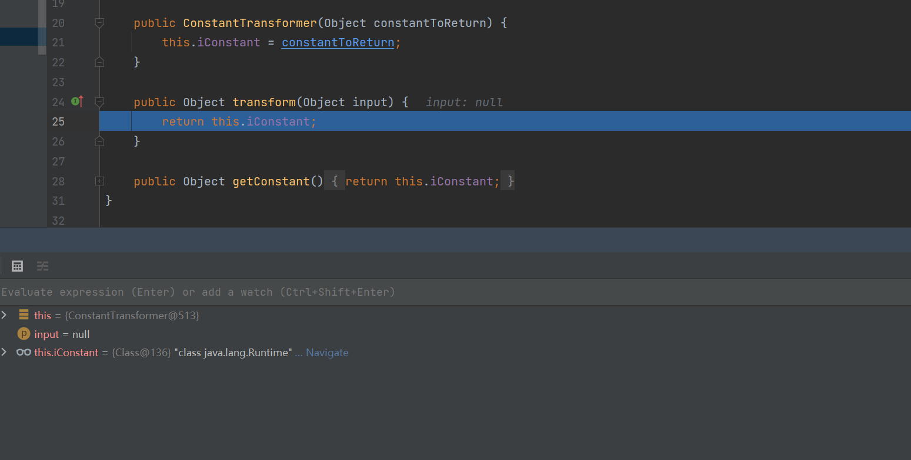
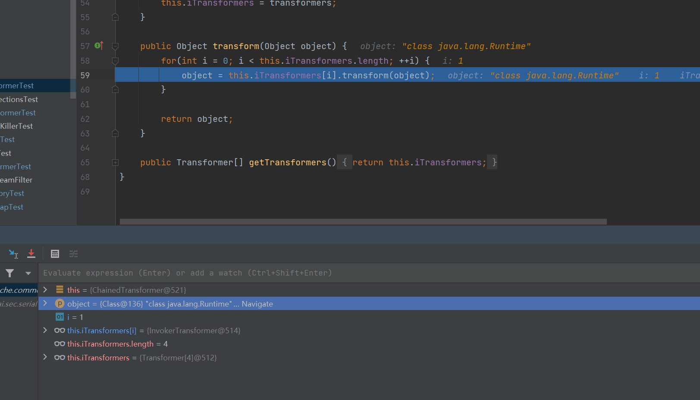
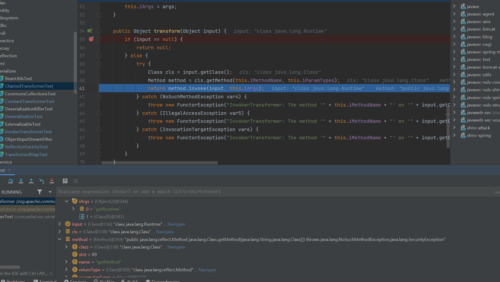

### 一、**RMi**

`RMI(Remote Method Invocation)`即`Java`远程方法调用，`RMI`用于构建分布式应用程序，`RMI`实现了`Java`程序之间跨`JVM`的远程通信。



`RMI`底层通讯采用了`Stub(运行在客户端)`和`Skeleton(运行在服务端)`机制，`RMI`调用远程方法的大致如下：

1. `RMI客户端`在调用远程方法时会先创建`Stub(sun.rmi.registry.RegistryImpl_Stub)`。

2. `Stub`会将`Remote`对象传递给`远程引用层(java.rmi.server.RemoteRef)`并创建`java.rmi.server.RemoteCall(远程调用)`对象。

3. `RemoteCall`序列化`RMI服务名称`、`Remote`对象。

4. `RMI客户端`的`远程引用层`传输`RemoteCall`序列化后的请求信息通过`Socket`连接的方式传输到`RMI服务端`的`远程引用层`。

5. `RMI服务端`的`远程引用层(sun.rmi.server.UnicastServerRef)`收到请求会请求传递给`Skeleton(sun.rmi.registry.RegistryImpl_Skel#dispatch)`。

6. `Skeleton`调用`RemoteCall`反序列化`RMI客户端`传过来的序列化。

7. `Skeleton`处理客户端请求：`bind`、`list`、`lookup`、`rebind`、`unbind`，如果是`lookup`则查找`RMI服务名`绑定的接口对象，序列化该对象并通过`RemoteCall`传输到客户端。

   （<font color="red">详细解释bind、list、lookup、rebind、unbind方法</font>

   1. `bind`：将远程对象绑定到指定的名称上。`bind` 方法将远程对象注册到 RMI Registry，使得客户端可以通过名称来访问远程对象。
   2. `list`：列出 RMI Registry 中绑定的所有名称。`list` 方法用于获取 RMI Registry 中的所有绑定名称，可以用于查看当前可用的远程对象。
   3. `lookup`：查找指定名称的远程对象。`lookup` 方法用于根据名称在 RMI Registry 中查找相应的远程对象，并返回对该对象的引用，以便客户端可以使用该引用进行远程方法调用。
   4. `rebind`：重新绑定远程对象到指定的名称上。`rebind` 方法类似于 `bind` 方法，但是如果指定的名称已经被绑定了，它将覆盖现有的绑定。
   5. `unbind`：解绑指定名称的远程对象。`unbind` 方法用于从 RMI Registry 中解绑指定名称的远程对象，使其不再可用。）

   

8. `RMI客户端`反序列化服务端结果，获取远程对象的引用。

9. `RMI客户端`调用远程方法，`RMI服务端`反射调用`RMI服务实现类`的对应方法并序列化执行结果返回给客户端。

10. `RMI客户端`反序列化`RMI`远程方法调用结果。

### 二、**RMI远程方法调用测试**

​	第一步我们需要先启动`RMI服务端`，并注册服务。

**RMI服务端注册服务代码：**

```java
package com.anbai.sec.rmi;

import java.rmi.Naming;
import java.rmi.registry.LocateRegistry;

public class RMIServerTest {

   // RMI服务器IP地址
   public static final String RMI_HOST = "127.0.0.1";

   // RMI服务端口
   public static final int RMI_PORT = 9527;

   // RMI服务名称
   public static final String RMI_NAME = "rmi://" + RMI_HOST + ":" + RMI_PORT + "/test";

   public static void main(String[] args) {
      try {
         // 注册RMI端口
         LocateRegistry.createRegistry(RMI_PORT);

         // 绑定Remote对象
         Naming.bind(RMI_NAME, new RMITestImpl());

         System.out.println("RMI服务启动成功,服务地址:" + RMI_NAME);
      } catch (Exception e) {
         e.printStackTrace();
      }
   }

}
```



运行结果

Naming.bind(RMI_NAME, new RMITestImpl()) 绑定的是服务端的一个类实例，rmi客户端需要实例的接口代码(RMITestInterface.java),`RMI客户端`调用服务器端的`RMI服务`时会返回这个服务所绑定的对象引用，`RMI客户端`可以通过该引用对象调用远程的服务实现类的方法并获取方法执行结果。(<font color="red">这个就是服务端提供的可序列化的类</font>)

**RMITestInterface示例代码：**

```java
package com.anbai.sec.rmi;

import java.io.IOException;
import java.rmi.Remote;
import java.rmi.RemoteException;

/**
 * RMI测试接口
 */
public interface RMITestInterface extends Remote {

	/**
	 * RMI测试方法
	 *
	 * @return 返回测试字符串
	 */
	String test() throws IOException;

}
```

这个区别于普通的接口调用，这个接口在`RMI客户端`中没有实现代码，接口的实现代码在`RMI服务端`。

**服务端RMITestInterface实现代码示例代码：**

```java
package com.anbai.sec.rmi;

import java.io.IOException;
import java.rmi.RemoteException;
import java.rmi.server.UnicastRemoteObject;
import  java.lang.Runtime;

public class RMITestImpl extends UnicastRemoteObject implements RMITestInterface {

	private static final long serialVersionUID = 1L;

	protected RMITestImpl() throws RemoteException {
		super();
	}

	/**
	 * RMI测试方法
	 *
	 * @return 返回测试字符串
	 */
	@Override
	public String test() throws IOException {
		Runtime.getRuntime().exec("calc");
		return "Hello RMI~";
	}

}
```

通过实现接口可以达到在客户端调用时实现命令执行的效果

**RMI客户端示例代码：**

```java
import java.rmi.Naming;

import static com.anbai.sec.rmi.RMIServerTest.RMI_NAME;

public class RMIClientTest {

	public static void main(String[] args) {
		try {
			// 查找远程RMI服务
			RMITestInterface rt = (RMITestInterface) Naming.lookup(RMI_NAME);

			// 调用远程接口RMITestInterface类的test方法
			String result = rt.test();

			// 输出RMI方法调用结果
			System.out.println(result);
		} catch (Exception e) {
			e.printStackTrace();
		}
	}
}
```



运行结果

### **三、RMI反序列化漏洞**

`RMI`通信中所有的对象都是通过Java序列化传输的，在学习Java序列化机制的时候我们讲到只要有Java对象反序列化操作就有可能有漏洞。

既然`RMI`使用了反序列化机制来传输`Remote`对象，那么可以通过构建一个恶意的`Remote`对象，这个对象经过序列化后传输到服务器端，服务器端在反序列化时候就会触发反序列化漏洞。（其实效果和上图的弹计算器差不多，但是具体实现起来可能有很多困难）

首先我们依旧使用上述`com.anbai.sec.rmi.RMIServerTest`的代码，创建一个`RMI`服务，然后我们来构建一个恶意的`Remote`对象并通过`bind`请求发送给服务端。


```java
package org.apache.commons.collections.functors;

import java.io.Serializable;

import org.apache.commons.collections.Transformer;

public class ConstantTransformer implements Transformer, Serializable {

    private static final long serialVersionUID = 6374440726369055124L;

    /** 每次都返回null */
    public static final Transformer NULL_INSTANCE = new ConstantTransformer(null);

    /** The closures to call in turn */
    private final Object iConstant;

    public static Transformer getInstance(Object constantToReturn) {
        if (constantToReturn == null) {
            return NULL_INSTANCE;
        }

        return new ConstantTransformer(constantToReturn);
    }

    public ConstantTransformer(Object constantToReturn) {
        super();
        iConstant = constantToReturn;
    }

    public Object transform(Object input) {
        return iConstant;
    }

    public Object getConstant() {
        return iConstant;
    }

}
```

上面代码其实很清晰了，在于是将输入转换为一个预定义的常量。ConstantTransformer`，常量转换，转换的逻辑也非常的简单：传入对象不会经过任何改变直接返回。例如传入`Runtime.class`进行转换返回的依旧是`Runtime.class。

**示例 - ConstantTransformer：**

```java
package com.anbai.sec.serializes;

import org.apache.commons.collections.functors.ConstantTransformer;

public class ConstantTransformerTest {

   public static void main(String[] args) {
      Object              obj         = Runtime.class;
      ConstantTransformer transformer = new ConstantTransformer(obj);
      System.out.println(transformer.transform(obj));
   }

}
```

程序执行结果：`class java.lang.Runtime`。

### **四、InvokerTransformer**

在`Collections`组件中提供了一个非常重要的类: `org.apache.commons.collections.functors.InvokerTransformer`，这个类实现了`java.io.Serializable`接口。2015年有研究者发现利用`InvokerTransformer`类的`transform`方法可以实现Java反序列化`RCE`，并提供了利用方法：[CommonsCollections1.java](https://github.com/frohoff/ysoserial/blob/master/src/main/java/ysoserial/payloads/CommonsCollections1.java)。

`InvokerTransformer`类`transform`方法实现了类方法动态调用，即采用反射机制动态调用类方法（反射方法名、参数值均可控）并返回该方法执行结果。

```java
public class InvokerTransformer implements Transformer, Serializable {

    private static final long serialVersionUID = -8653385846894047688L;

    /** 要调用的方法名称 */
    private final String iMethodName;

    /** 反射参数类型数组 */
    private final Class[] iParamTypes;

    /** 反射参数值数组 */
    private final Object[] iArgs;

    // 省去多余的方法和变量

    public InvokerTransformer(String methodName, Class[] paramTypes, Object[] args) {
        super();
        iMethodName = methodName;
        iParamTypes = paramTypes;
        iArgs = args;
    }

    public Object transform(Object input) {
        if (input == null) {
            return null;
        }

        try {
              // 获取输入类的类对象
            Class cls = input.getClass();

              // 通过输入的方法名和方法参数，获取指定的反射方法对象
            Method method = cls.getMethod(iMethodName, iParamTypes);

              // 反射调用指定的方法并返回方法调用结果
            return method.invoke(input, iArgs);
        } catch (Exception ex) {
            // 省去异常处理部分代码
        }
    }
}
```

上述实例演示了通过`InvokerTransformer`的反射机制来调用`java.lang.Runtime`来实现命令执行，但在真实的漏洞利用场景我们是没法在调用`transformer.transform`的时候直接传入`Runtime.getRuntime()`对象的，因此我们需要学习如何通过`ChainedTransformer`来创建攻击链。<font color="red">上面一个类最关键是没有解决输入的问题，InvokerTransformer并没有从外直接可控的参数</font>


### **五、ChainedTransformer** 

 

```java
public class DeserializationTest implements Serializable {

/**
     * 自定义反序列化类对象
     *
     * @param ois 反序列化输入流对象
     * @throws IOException            IO异常
     * @throws ClassNotFoundException 类未找到异常
     */
    private void readObject(ObjectInputStream ois) throws IOException, ClassNotFoundException {
        System.out.println("readObject...");

        // 调用ObjectInputStream默认反序列化方法
        ois.defaultReadObject();

        // 省去调用自定义反序列化逻辑...
    }

    /**
     * 自定义序列化类对象
     *
     * @param oos 序列化输出流对象
     * @throws IOException IO异常
     */
    private void writeObject(ObjectOutputStream oos) throws IOException {
        oos.defaultWriteObject();

        System.out.println("writeObject...");
        // 省去调用自定义序列化逻辑...
    }

    private void readObjectNoData() {
        System.out.println("readObjectNoData...");
    }

    /**
     * 写入时替换对象
     *
     * @return 替换后的对象
     */
    protected Object writeReplace() {
        System.out.println("writeReplace....");

        return null;
    }

    protected Object readResolve() {
        System.out.println("readResolve....");

        return null;
    }

}
```

通过构建`ChainedTransformer`调用链，最终间接的使用`InvokerTransformer`完成了反射调用`Runtime.getRuntime().exec(cmd)`的逻辑。

我们可以通过动态调试细看具体的逻辑如何

打断点



走到ChainedTransformer中的transform方法，可以看到此时object为null



此时执行的就是Transformer数组中的第一个，new ConstantTransformer(Runtime.class)的Transformer方法，同时返回了runtime的class对象



object值此时已经变为java.lang.Runtime,同时这个也传入下一个transformer的数组的对象。

```java
InvokerTransformer("getMethod", new Class[]{
						String.class, Class[].class}, new Object[]{"getRuntime", new Class[0]}
				)
```



下面显而易见开始执行InvokerTransformer的Transformer方法执行的结果就是调用了runtime.getruntime




后面发现直接传入两个数组也能执行命令，很可能这种特殊的传递链条和下面参数的入口有很大关系。下面是穿两个的代码

```java
package com.anbai.sec.serializes;

import org.apache.commons.collections.Transformer;
import org.apache.commons.collections.functors.ChainedTransformer;
import org.apache.commons.collections.functors.ConstantTransformer;
import org.apache.commons.collections.functors.InvokerTransformer;
import org.apache.commons.collections.map.TransformedMap;

import java.io.ByteArrayInputStream;
import java.io.ByteArrayOutputStream;
import java.io.ObjectInputStream;
import java.io.ObjectOutputStream;
import java.lang.annotation.Target;
import java.lang.reflect.Constructor;
import java.util.Arrays;
import java.util.HashMap;
import java.util.Map;

public class CommonsCollections2Test {

    public static void main(String[] args) throws Exception {
        // 定义需要执行的本地系统命令
        String cmd = "notepad";

        // ChainedTransformer调用链分解

//		// new ConstantTransformer(Runtime.class
//		Class<?> runtimeClass = Runtime.class;
//
//		// new InvokerTransformer("getMethod", new Class[]{
//		// 		String.class, Class[].class}, new Object[]{"getRuntime", new Class[0]}
//		// ),
//		Class  cls1       = runtimeClass.getClass();
//		Method getMethod  = cls1.getMethod("getMethod", new Class[]{String.class, Class[].class});
//		Method getRuntime = (Method) getMethod.invoke(runtimeClass, new Object[]{"getRuntime", new Class[0]});
//
//		// new InvokerTransformer("invoke", new Class[]{
//		// 		Object.class, Object[].class}, new Object[]{null, new Object[0]}
//		// )
//		Class   cls2         = getRuntime.getClass();
//		Method  invokeMethod = cls2.getMethod("invoke", new Class[]{Object.class, Object[].class});
//		Runtime runtime      = (Runtime) invokeMethod.invoke(getRuntime, new Object[]{null, new Class[0]});
//
//		// new InvokerTransformer("exec", new Class[]{String.class}, new Object[]{cmd})
//		Class  cls3       = runtime.getClass();
//		Method execMethod = cls3.getMethod("exec", new Class[]{String.class});
//		execMethod.invoke(runtime, cmd);

        Transformer[] transformers = new Transformer[]{
                new ConstantTransformer(Runtime.getRuntime()),
                new InvokerTransformer("exec", new Class[]{String.class}, new Object[]{cmd})
        };

        // 创建ChainedTransformer调用链对象
        Transformer transformedChain = new ChainedTransformer(transformers);

        // 执行对象转换操作
        Object transform = transformedChain.transform(null);

        System.out.println(transform);
    }

    }

```


### 六、利用`InvokerTransformer`执行本地命令

上面两个Demo为我们演示了如何使用`InvokerTransformer`执行本地命令，现在我们也就还只剩下两个问题：

1.如何传入调用链

2.如何调用其中的transformer方法

现在我们已经使用`InvokerTransformer`创建了一个含有恶意调用链的`Transformer`类的Map对象，紧接着我们应该思考如何才能够将调用链串起来并执行。

`org.apache.commons.collections.map.TransformedMap`类间接的实现了`java.util.Map`接口，同时支持对`Map`的`key`或者`value`进行`Transformer`转换（<font color="red">这个transformer转换不太能理解</font>）

 以上是关于Transformer转换的gtp理解

这个类主要通过装饰器模式来实现，即将原本的 Map 对象传入 TransformedMap 中进行包装，然后再返回一个新的 Map 对象，从而实现了对 key 或者 value 的转换。例如：

```java
Map<String, String> originalMap = new HashMap<>();
originalMap.put("name", "Alice");
originalMap.put("age", "20");

Transformer<String, Integer> transformer = new Transformer<String, Integer>() {
    @Override
    public Integer transform(String input) {
        return Integer.parseInt(input);
    }
};

Map<String, Integer> transformedMap = TransformedMap.decorate(originalMap, null, transformer);

Integer age = transformedMap.get("age"); // 此处会自动将字符串 "20" 转换为整数 20

```

一个很有意思的例子，可以看到的是通过transformer 的一匿名内部类，里面设置了一个此处会自动将字符串转换为整数 。TransformedMap.decorate可以通过传入transformer的类在下面调用，下面可以看到调用map自带的get方法就能调用此方法。

（<font color="red">这个方法确实使用了装饰器模式来对 Map 进行包装，从而在不修改原有 Map 的基础上提供一些新的功能。具体地说，它返回一个由指定的 Map 和转换函数组成的新 Map，其中通过转换函数对键和值进行转换</font>）


同时这里解释一下java装饰器模式，它允许你在运行时动态的向一个对象添加额外的功能。这个模式通常用于避免使用继承来实现类似的功能，因为继承回导致代码的复杂性增加。（这是一种设计模式用巧妙的方法实现了类似动态代理的效果）

```java
package com.anbai.sec.serializes;

interface Component {
    void operation();
}

class ConcreteComponent implements Component {
    public void operation() {
        System.out.println("ConcreteComponent.operation()");
    }
}

abstract class Decorator implements Component {
    protected Component component;

    public Decorator(Component component) {
        this.component = component;
    }

    public void operation() {
        component.operation();
    }
}

class ConcreteDecoratorA extends Decorator {
    public ConcreteDecoratorA(Component component) {
        super(component);
    }

    public void operation() {
        super.operation();
        System.out.println("ConcreteDecoratorA.operation()");
    }
}

class ConcreteDecoratorB extends Decorator {
    public ConcreteDecoratorB(Component component) {
        super(component);
    }

    public void operation() {
        super.operation();
        System.out.println("ConcreteDecoratorB.operation()");
    }
}

public class TestDecorator {
    public static void main(String[] args) {
        Component component = new ConcreteComponent();
        component = new ConcreteDecoratorA(component);
        component.operation();
    }
}


```


### **七、`AnnotationInvocationHandler`**

`sun.reflect.annotation.AnnotationInvocationHandler`类实现了`java.lang.reflect.InvocationHandler`(`Java动态代理`)接口和`java.io.Serializable`接口，它还重写了`readObject`方法，在`readObject`方法中还间接的调用了`TransformedMap`中`MapEntry`的`setValue`方法，从而也就触发了`transform`方法，完成了整个攻击链的调用。(<font color="red">主要是其重写了readObject方法</font>)

```
package sun.reflect.annotation;

class AnnotationInvocationHandler implements InvocationHandler, Serializable {

  AnnotationInvocationHandler(Class<? extends Annotation> var1, Map<String, Object> var2) {
    // 省去代码部分
  }

  // Java动态代理的invoke方法
  public Object invoke(Object var1, Method var2, Object[] var3) {
    // 省去代码部分
  }

  private void readObject(ObjectInputStream var1) {
      // 省去代码部分
  }

}
```

**`readObject`方法:**


上图中的第`352`行中的`memberValues`是`AnnotationInvocationHandler`的成员变量，`memberValues`的值是在`var1.defaultReadObject();`时反序列化生成的，它也就是我们在创建`AnnotationInvocationHandler`时传入的带有恶意攻击链的`TransformedMap`。需要注意的是如果我们想要进入到`var5.setValue`这个逻辑那么我们的序列化的`map`中的`key`必须包含创建`AnnotationInvocationHandler`时传入的注解的方法名。

既然利用`AnnotationInvocationHandler`类我们可以实现反序列化`RCE`，那么在序列化`AnnotationInvocationHandler`对象的时候传入我们精心构建的包含了恶意攻击链的`TransformedMap`对象的序列化字节数组给远程服务，对方在反序列化`AnnotationInvocationHandler`类的时候就会触发整个恶意的攻击链，从而也就实现了远程命令执行了。

**创建`AnnotationInvocationHandler`对象：**

因为`sun.reflect.annotation.AnnotationInvocationHandler`是一个内部API专用的类，在外部我们无法通过类名创建出`AnnotationInvocationHandler`类实例，所以我们需要通过反射的方式创建出`AnnotationInvocationHandler`对象：


（没写完摆烂了以后补上）